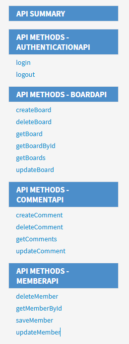
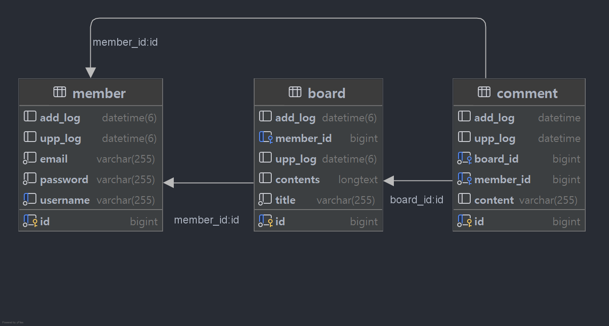

### [ Spring 입문 프로젝트 ]

## 개발 환경

> IDE : IntelliJ IDEA Community Edition  
> JDK : OpenJDK 17  
> SpringBoot : 3.4.4

## 디렉토리 구조

```md
src
├── main
│ ├── java
│ │ ├── com.example.jpa_board
│ │ │ ├── JpaBoardApplication.java
│ │ │ ├── config
│ │ │ │ ├── auth
│ │ │ │ │ ├── AuthFilter.java
│ │ │ │ ├── exception
│ │ │ │ │ ├── CustomException.java
│ │ │ │ │ ├── ExceptionDto.java
│ │ │ │ │ ├── ExceptionErrorCode.java
│ │ │ │ │ ├── GlobalExceptionHandler.java
│ │ │ │ ├── security
│ │ │ │ │ ├── PasswordEncoder.java
│ │ │ ├── controller
│ │ │ │ ├── board
│ │ │ │ │ ├── BoardController.java
│ │ │ │ ├── comment
│ │ │ │ │ ├── CommentController.java
│ │ │ │ ├── login
│ │ │ │ │ ├── LoginController.java
│ │ │ │ ├── member
│ │ │ │ │ ├── MemberController.java
│ │ │ ├── dto
│ │ │ │ ├── board
│ │ │ │ │ ├── BoardListResponseDto.java
│ │ │ │ │ ├── BoardRequestDto.java
│ │ │ │ │ ├── BoardResponseDto.java
│ │ │ │ ├── comment
│ │ │ │ │ ├── CommentRequestDto.java
│ │ │ │ │ ├── CommentResponseDto.java
│ │ │ │ ├── member
│ │ │ │ │ ├── LoginRequestDto.java
│ │ │ │ │ ├── MemberRequestDto.java
│ │ │ │ │ ├── MemberResponseDto.java
│ │ │ ├── entity
│ │ │ │ ├── BaseEntity.java
│ │ │ │ ├── Board.java
│ │ │ │ ├── Comment.java
│ │ │ │ ├── Member.java
│ │ │ ├── repository
│ │ │ │ ├── board
│ │ │ │ │ ├── BoardRepository.java
│ │ │ │ ├── comment
│ │ │ │ │ ├── CommentRepository.java
│ │ │ │ ├── member
│ │ │ │ │ ├── MemberRepository.java
│ │ │ ├── service
│ │ │ │ ├── board
│ │ │ │ │ ├── BoardService.java
│ │ │ │ ├── comment
│ │ │ │ │ ├── CommentService.java
│ │ │ │ ├── member
│ │ │ │ │ ├── MemberService.java
```

## API 문서 - 바로가기

[](https://sw00y.github.io/ch3-jpaboard/)

## ERD



## 트러블 슈팅

<details>
<summary style="font-size: 16px;"><strong>게시글에 대한 댓글의 Count</strong></summary>

1. 문제상황

- DB에서 게시글의 제목과 내용을 가져올 때 해당 게시글에 작성된 댓글 갯수를 함께 가져와야한다.

> 방식 1 : JPA 연관관계 양방향 - OneToMany  
> 방식 2 : Repository 에서 직접 Comment 의 Count 조회

2. 원인분석

> 방식 1은 조건사항에 부합하지 않다고 생각해서 배제했고, JPQL로 진행하기로 했다.

3. 해결방법

```java

@Query("SELECT a, COUNT(b) FROM Board a LEFT JOIN Comment b ON a.id = b.board.id " +
        "GROUP BY a ORDER BY a.uppLog DESC")
Page<Object[]> findAllWithCommentCount(Pageable pageable);
```

> 방법은 정말 다양했는데
> Repository에서 해당 Dto를 가지고 가지고 오는 방법도 있었지만 코드가 보기 어려워 리턴을 Object[]로 받아서 Serivce에서 후처리를 진행하기로 했다!

> Service에서 후처리를 진행해야했다.
> row가 2개로 나왔으며, row[0] 은 a, row[1] 은 b로 각각 a = Board, b = count(Comment) 두개를 가지고 Response를 생성해서 반환했다.

</details>

<details>
<summary style="font-size: 16px;"><strong>작성일 JPA Auditing 활용</strong></summary>

1. 문제상황

- 작성일, 수정일 필드는 JPA Auditing을 활용합니다.

> 생성자에서 LocalDateTime.now() 로 직접 넣어주면 되지않나..? 가 의문이었다.
> 이미 Scedule 일정관리에서 해당 방식을 사용해서 진행했었기 때문에 ... 굳이? 라는 생각이었다.

2. 정리

> JPA Auditing의 장점은 '자동화'와 '일관성' 이다.
> 모든 엔티티에서 공통적으로 사용하는 생성/수정일 필드를 중복 없이 관리할 수 있다.
> 엔티티 생성 시 자동으로 시간 값을 넣어주기 때문에 코드 간결성 확보.
> Auditing을 사용하는 것이 더 효율적이며 유지보수에 좋은 방식이었다.

```java
public abstract class BaseEntity {

    @CreatedDate
    @Column(updatable = false)
    private LocalDateTime addLog;

    @LastModifiedDate
    private LocalDateTime uppLog;
}
```

> 해당방식으로 진행했다.
>
</details>

**후기**

1. 어떠한 문제에 있어서 해결하는 방식은 정말 다양한데 그 중 최선의 방법을 찾는 방식이 궁금하다.
    - 성능(응답시간), 코드가독성 등등.. 비교해서 나에게 맞는걸 선택하는건지..?
2. Entity의 예외처리를 Service에서 진행해서 ExceptionHandler, Enum(ErrorCode) 로 한곳에서 예외처리를 진행하면 편할것 같은데 괜찮은가요..?